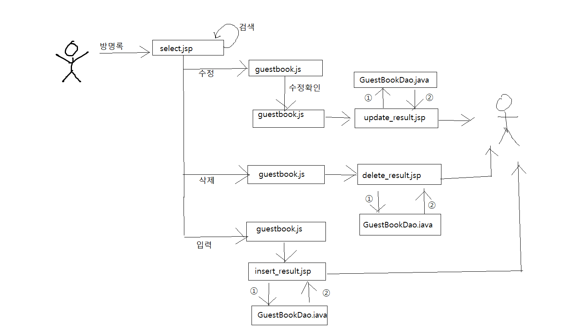

# 목차

- [목차](#목차)
- [1. 방명록 Insert (흐름참고)](#1-방명록-insert-흐름참고)
	- [1.1. insert.jsp를 select.jsp에 정적으로 삽입](#11-insertjsp를-selectjsp에-정적으로-삽입)
	- [1.2.insert.jsp생성](#12insertjsp생성)
		- [1.2.1. 설계](#121-설계)
		- [1.3. guestbook.js 설계](#13-guestbookjs-설계)
		- [1.4. insert_result.jsp](#14-insert_resultjsp)
			- [1.4.1. 한글 깨지는 것 방지위한 인코딩](#141-한글-깨지는-것-방지위한-인코딩)
			- [1.4.2. useBean으로 Vo클래스 가져옴 & setProperty 활용](#142-usebean으로-vo클래스-가져옴--setproperty-활용)
			- [1.4.3. msg변수 설정해주고 request에 msg를 설정](#143-msg변수-설정해주고-request에-msg를-설정)
			- [1.4.4. script](#144-script)
	- [1.3. Dao클래스의 insert메소드](#13-dao클래스의-insert메소드)
- [2. 방명록 Update](#2-방명록-update)
	- [2.1. Select.jsp](#21-selectjsp)
	- [2.2 guestbook.js에서 funcUpdate function 추가](#22-guestbookjs에서-funcupdate-function-추가)
	- [2.3. update_result.jsp](#23-update_resultjsp)
		- [2.3.1. 한글 꺠짐 방지 위한 인코딩 작업](#231-한글-꺠짐-방지-위한-인코딩-작업)
		- [2.3.2. useBean과 Property사용](#232-usebean과-property사용)
		- [2.3.3. dao클래스의 update메소드에 vo삽입](#233-dao클래스의-update메소드에-vo삽입)
		- [2.3.4. script 부분](#234-script-부분)
	- [2.4. GuestBookDao에서 update 메소드 추가](#24-guestbookdao에서-update-메소드-추가)
- [3. 방명록 Delete](#3-방명록-delete)
	- [3.1. select.jsp에서 수정및 추가](#31-selectjsp에서-수정및-추가)
	- [3.2. guestbook.js에서 funcDelete function 추가](#32-guestbookjs에서-funcdelete-function-추가)
	- [3.3. delete_result.jsp](#33-delete_resultjsp)
		- [3.3.1. UTF-8인코딩](#331-utf-8인코딩)
		- [3.3.2. useBean과 setProperty활용](#332-usebean과-setproperty활용)
		- [3.3.3. dao클래스의 delete메소드에 vo삽입](#333-dao클래스의-delete메소드에-vo삽입)
		- [3.3.4. script](#334-script)
	- [3.4. GuestBookVo에서 delete메소드 추가](#34-guestbookvo에서-delete메소드-추가)
- [4 방명록 흐름(처음으로가기)](#4-방명록-흐름처음으로가기)

# 1. 방명록 Insert [(흐름참고)](#4-방명록-흐름처음으로가기)
(참고)하다가 헷갈려서 막 기술. 이 순서대로 만드는 것은 아님
<br>

## 1.1. insert.jsp를 [select.jsp](../kh-web-20201202/WebContent/guestbook/select.jsp)에 정적으로 삽입
- 경로는 select 페이지 기준
```java
	<%@include file="./insert.jsp" %>

```

## 1.2.[insert.jsp생성](../kh-web-20201202/WebContent/guestbook/insert.jsp)
- insert를 위한 ui를 만들어준다
- 작성자는 session에서 불러온 id  
작성날은 new Date()를 이용
- textarea의 disabled를 삭제 
  - insert를 하기위해서는 활성화되야하기때문
```java
<form name='frm_gb_insert' id = 'frm_gb_insert' method='POST'>
		<label>작성자</label>
		<input type = 'text' name = 'mid' readonly class='mid' value ='${sessionScope.mid }'/>
		<label>작성일</label>
		<output class='mdate'><%=new Date().toLocaleString() %></output>
		<br>
		<textarea name = 'doc' cols ='80' rows='5'></textarea>
		<div class = 'btns'>
			<label>암호</label>
			<input type = 'password' name = 'pwd'/>
			<input type = 'button' value= '저장' id = 'btnInsert'/>	
		</div>
	</form>
```

### 1.2.1. 설계
- 로그아웃이 될 경우는 inser ui표시안하고 로그인이 됐을 때만 보이도록 작업
  - select.jsp에서 
- jstl을 활용해 sessionScope에 mid가 empty가 아닐때 insert 화면이 뜨도록 설정
- If문을 사용해보자
```java
	<c:if test="${not empty sessionScope.mid }">  <!-- 비어있지 않을 때 -->
		<%--방명록 입력화면 --%>
		<%@include file="./insert.jsp" %>
	</c:if>
    <c:if test="${empty sessionScope.mid }">
		<font color = 'red'>로그인하시면 방명록을 작성할 수 있습니다.</font>
	</c:if>
```
- choose문을 사용해보자

```java
	<c:choose>
		<c:when test="${not empty sessionScope.mid }">		
			<%@include file="./insert.jsp" %>
		</c:when>
		<c:otherwise>
			<font color = 'red'>로그인하시면 방명록을 작성할 수 있습니다.</font>
		</c:otherwise>
	</c:choose>
```

### 1.3. [guestbook.js](../kh-web-20201202/WebContent/js/guestbook.js) 설계
- guestbook이라는 function 생성
- btnInsert를 클릭하면 inser_result.jsp로 가는 action
- 제이쿼리는 null부분을 자동으로 처리해주기때문에 더 간편
- select.jsp의 script부분에 guestbook()삽입해주면 끝
```java
var guestbook = function() {
	//방명록 입력 버튼이 클릭된 경우
	var btnInsert = document.getElementById('btnInsert');
	
	//javascript
	if(btnInsert != null){
		btnInsert.onclick = function(){
			var frm = document.frm_gb_insert;
			frm.action = './guestbook/insert_result.jsp';
			frm.submit();
		}
	}
	
	//제이쿼리
/*	$('#btnInsert').click(function(){
		$('#frm_gb_insert').action = './guestbook/insert_result.jsp';
		$('#frm_gb_insert').submit();
		
	})*/
}
```

### 1.4. [insert_result.jsp](../kh-web-20201202/WebContent/guestbook/insert_result.jsp)
#### 1.4.1. 한글 깨지는 것 방지위한 인코딩
- **상단에** 위치해야만 하는 것 주의!
```java
<%	request.setCharacterEncoding("UTF-8"); %>

```
#### 1.4.2. useBean으로 Vo클래스 가져옴 & setProperty 활용
- setProperty를 통해 form에 있는 모든 정보가 vo에 들어간다

```java
<jsp:useBean id="vo" class="gbook.GuestBookVo"/> 
<jsp:setProperty property="*" name = "vo" />
```

#### 1.4.3. msg변수 설정해주고 request에 msg를 설정
```java
<% 
	String msg = dao.insert(vo);
	request.setAttribute("msg", msg);
%>
```

#### 1.4.4. script
  
```java
<script>
	var msg = '${msg}'; //script내에서 jstl사용가능
	alert(msg);
	location.href = '../index.jsp?inc=./guestbook/select.jsp';
</script>

```

## 1.3. [Dao클래스](../kh-web-20201202/src/gbook/GuestBookDao.java)의 insert메소드
- serial에는 시퀀스값을 넣어줌
- insert이기 때문에 executeUpdate를 사용
```java
public String insert(GuestBookVo vo) {
		String msg = "방명록이 작성되었습니다.";
		try {
			String sql = " insert into guestbook(serial, mid, pwd, doc, mdate) "
					   + " values(seq_guestbook.nextval, ?, ?, ?, sysdate )";
			
			ps = conn.prepareStatement(sql);
			ps.setString(1, vo.getMid());
			ps.setString(2, vo.getPwd());
			ps.setString(3, vo.getDoc());

			int rowCnt = ps.executeUpdate(); //insert된 행수
			if(rowCnt<1) {
				msg = "방명록 입력중 오류발생"	;
			}
		} catch (Exception ex) {
			ex.printStackTrace();
			msg = ex.getMessage();
		}finally {
			
			try {
				conn.close();
			} catch (SQLException e) {
				e.printStackTrace();
			}
			return msg;
		}
	}
```

# 2. 방명록 Update
## 2.1. [Select.jsp](../kh-web-20201202/WebContent/guestbook/select.jsp)
- 여기에 update에 관한 항목들을 추가시킬겁니다  
  -  ─────────── select.jsp에서 수정 및 추가 ──────────
  - 하나의 방명록 항목을 'form'안에 작성
  - 아이디(mid)의 표시 항목을 'input type = 'text' readyOnly'로 수정
  - serial번호를 hidden으로 추가
  - 수정부분에 onclick추가  
    - 수정버튼을 click하면 동작하도록  
  - ─────────── 아래는 javascript로 구현 ───────────
  - textarea의 상태값을 disalbe -> enable (수정가능하도록)
  - 수정 버튼이 클릭되면 prompt창을 통해 암호를 입력
```java
<div id = 'list'>
		<c:forEach var ='vo' items ='${list }'>
			<div id = 'item'>
				<form name = 'frm_temp' method = 'POST'> //**form추가
					<label>작성자</label>
					<input type = ' text' name = 'mid' readOnly class ='mid' value = '${vo.mid }'/> //** type = 'text' , readOnly수정
					<label>작성일자</label>
					<output class ='mdate'>${vo.mdate}</output>
					<br>
					<textarea rows ="5" cols='80' disabled name='doc'>${vo.doc }</textarea> 
					<br>
					
					<c:if test="${vo.mid == sessionScope.mid }">
						<div class='btns'>
							<input type = 'button' value = '수정' id = 'btnUpdate' name = 'btnUpdate' onclick = 'funcUpdate(this.form)'/>
							<input type = 'button' value = '삭제' id = 'btnDelete'  onclick = 'funcDelete(this.form)'/>
							//**각각 onclick 추가
						</div>
					</c:if>
					<input type = 'text' name = 'serial' value = '${vo.serial }'/> //**serial 추가
					<input type = 'hidden' name = 'pwd' />
				</form>
			</div>
		</c:forEach>
	</div>

```

## 2.2 [guestbook.js](../kh-web-20201202/WebContent/js/guestbook.js)에서 funcUpdate function 추가
- btnUpdate가 '수정'이라면 
  - disabled를 false로 바꿈 
    - textarea창이 활성화됨
  - btnUpdate의 value를 '수정내용저장'으로 바꿈
    - 수정을 하면 저장을 하기 위함. 
- btnUpdate가 '수정내용저장'이라면
  - prompt에 암호입력창뜨게함
    - hidden으로 있던 pwd창에 입력한 pwd를 대입
  - update_result.jsp로 넘어가도록 action
  - *submit() 꼭 !!!* (안해서 오류났었음;)
```java
function funcUpdate(frm){
	if(frm.btnUpdate.value=='수정'){
		frm.doc.disabled = false;
		frm.btnUpdate.value='수정내용저장';
	}else if(frm.btnUpdate.value=='수정내용저장'){
		let pwd = prompt("수정된 내용을 저장하시려면 암호를 입력하세요");
		frm.pwd.value = pwd;
		frm.action = './guestbook/update_result.jsp';
		frm.submit();
	}
}
```
## 2.3. [update_result.jsp](../kh-web-20201202/WebContent/guestbook/update_result.jsp)
(참고) hint는 [insert_result.jsp](../kh-web-20201202/WebContent/guestbook/insert_result.jsp)참고
### 2.3.1. 한글 꺠짐 방지 위한 인코딩 작업
```java
<% request.setCharacterEncoding("UTF-8"); %>
```

### 2.3.2. useBean과 Property사용
- useBean을 사용하여 GuestBookDao와 GuestBookVo를 불러온다(import개념)
  - 이때 패키지명도 꼭 작성을 해야함
- setProperty를 이용해 모든 vo에 setter, getter 작동시킴
```java
<jsp:useBean id = "dao" class="gbook.GuestBookDao" />
<jsp:useBean id = "vo" class="gbook.GuestBookVo" />
<jsp:setProperty property="*" name = "vo" />
```

### 2.3.3. dao클래스의 update메소드에 vo삽입 
- dao클래스의 update메소드 안에 vo삽입한 값은 msg라는 문자열 변수로 받음
- 이 문자열을 request의 속성에 msg로 set
  - *이해안가는 부분 ㅡㅡ*
```java
	String msg = dao.update(vo);
	request.setAttribute("msg", msg);
%>
```

### 2.3.4. script 부분
- msg를 띄우고 select.jsp로 이동
```java
<script>
	alert('${msg}');
	location.href = '../index.jsp?inc=./guestbook/select.jsp';
</script>
```

## 2.4. [GuestBookDao에서 update 메소드 추가](../kh-web-20201202/src/gbook/GuestBookDao.java)
```java
public String update(GuestBookVo vo) {
		String msg = "방명록 내용을 수정하였습니다.";
		
		try {
			String sql = "update guestbook set doc=? where serial=? and pwd=?";
			
			ps = conn.prepareStatement(sql);
			ps.setString(1, vo.getDoc());
			ps.setInt(2, vo.getSerial());
			ps.setString(3, vo.getPwd());
			
			int rowCnt = ps.executeUpdate();
			if(rowCnt < 1) {
				msg = "방명록 수정 중 오류발생";
			}
			
		} catch (Exception ex) {
			msg = ex.getMessage();
		}finally {
			try {
				conn.close();
			} catch (SQLException e) {
				e.printStackTrace();
			}
			return msg;
		}
	}
```
# 3. 방명록 Delete

- 삭제버튼에 onclick 추가
- prompt창을 통해 암호 입력
## 3.1. select.jsp에서 수정및 추가
- 삭제버튼에 onclick 추가
```java
<input type = 'button' value = '삭제' id = 'btnDelete' onclick = 'funcDelete(this.form)'/>

```

## 3.2. [guestbook.js](../kh-web-20201202/WebContent/js/guestbook.js)에서 funcDelete function 추가
- prompt에 암호를 입력 할 수 있도록 띄워줌
- hidden태그에 입력받은 값을 집어넣고 delete_result.jsp로 이동하게끔
- submit()은 필수
```java
function funcDelete(frm){
	let pwd = prompt("방명록을 삭제하시려면 작성시 암호를 입력해주세요");
	frm.pwd.value = pwd; //hidden태그에 값을 집어넣음
	frm.action = './guestbook/delete_result.jsp';
	frm.submit();
}
```

## 3.3. [delete_result.jsp](../kh-web-20201202/WebContent/guestbook/delete_result.jsp)
- 앞의 update와 거의 유사하다

### 3.3.1. UTF-8인코딩
```java
<% request.setCharacterEncoding("UTF-8"); %>
```

### 3.3.2. useBean과 setProperty활용
```java
<jsp:useBean id = "dao" class = "gbook.GuestBookDao"/>
<jsp:useBean id = "vo" class = "gbook.GuestBookVo" />
<jsp:setProperty property="*" name="vo"/>
```

### 3.3.3. dao클래스의 delete메소드에 vo삽입
```java
<%
	String msg = dao.delete(vo);
	request.setAttribute("msg", msg);
	
%>
```

### 3.3.4. script
```java
<script>
	alert('${msg}');
	location.href = '../index.jsp?inc=./guestbook/select.jsp';
</script>

```

## 3.4. [GuestBookVo](../kh-web-20201202/src/gbook/GuestBookDao.java)에서 delete메소드 추가
- delete의 경우에는 where절을 안써주고 실행하면 db 데이터가 몽땅 날아가기 때문에 조심
```java
	public String delete(GuestBookVo vo) {
		String msg = "방명록이 삭제되었습니다.";
		try {
			String sql = "delete from guestbook where serial=? and pwd=?";
			ps = conn.prepareStatement(sql);
			ps.setInt(1, vo.getSerial());
			ps.setString(2, vo.getPwd());
			
			int rowCnt = ps.executeUpdate();
			if(rowCnt<1) {
				msg = "방명록 삭제 중 오류발생";
			}
			
		} catch (Exception ex) {
			msg = ex.getMessage();
		} finally {
			try {
				conn.close();
			} catch (SQLException e) {
				e.printStackTrace();
			}
			return msg;
		}
	}
```
# 4 방명록 흐름[(처음으로가기)](#1-방명록-insert-흐름참고)

