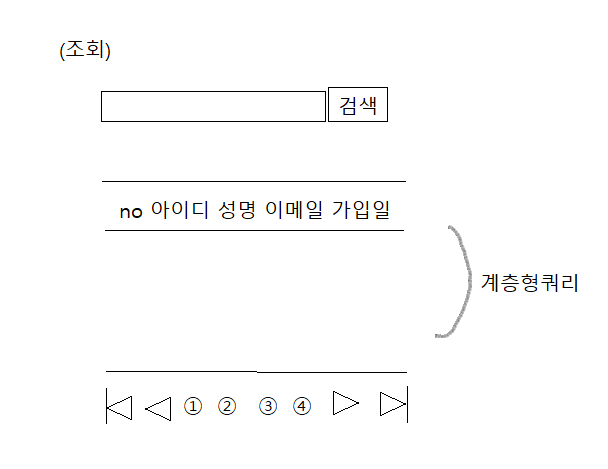
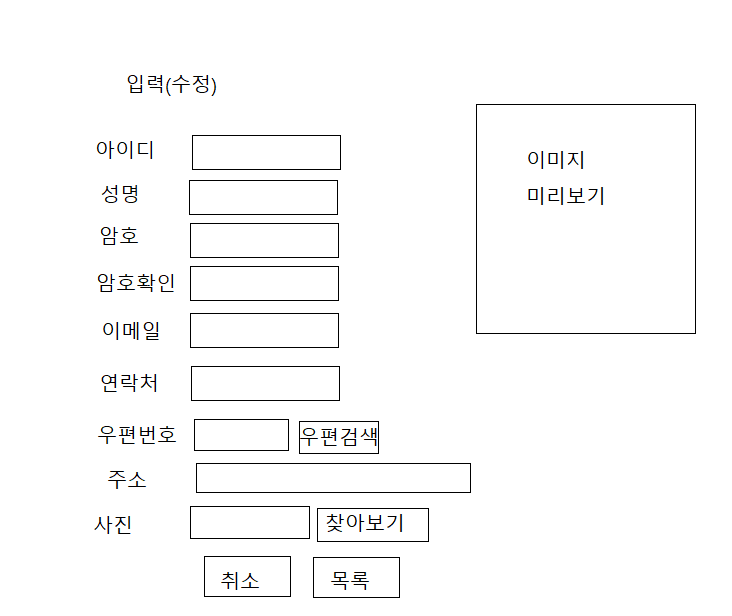

# 목차

- [목차](#목차)
- [1. 서블릿](#1-서블릿)
  - [1.1. FirstServlet.java 생성](#11-firstservletjava-생성)
  - [1.2. servlet_test.jsp 생성](#12-servlet_testjsp-생성)
- [2. 서블릿으로 회원관리](#2-서블릿으로-회원관리)
  - [2.1. 설계](#21-설계)
    - [2.1.1. 생성할 파일](#211-생성할-파일)
    - [2.2.2 설계](#222-설계)
  - [(참고)참고할만한 페이징 기능 관련 블로그](#참고참고할만한-페이징-기능-관련-블로그)
  - [2.2.3 uI설계](#223-ui설계)


# 1. 서블릿
## 1.1. FirstServlet.java 생성
- httpServlet을 상속
- a+s+s => override/implement methods에서 doPost와 doGet만 체크 
- `WebServlet 어노테이션` 생성
  - /test.do라는 url이 들어오면 FirstServlet으로 이동시켜달라  
  ex) localhost:8888/.../test.do 
```java
@WebServlet(urlPatterns = "/test.do")
```
- doGet
```java
	@Override
	protected void doGet(HttpServletRequest request, HttpServletResponse response) throws ServletException, IOException {

		System.out.println("doGet()에 의해서 실행된 코드");
		
		// test.do?mid=hong&phone=010-1111-1111 : get타입
		System.out.println(request.getParameter("mid"));
		System.out.println(request.getParameter("phone"));
	}
```
- doPost
```java
@Override
	protected void doPost(HttpServletRequest request, HttpServletResponse response) throws ServletException, IOException {
		System.out.println("doPost()에 의해서 실행된 코드");
		
		// <form method = 'POST' /> :post타입
		System.out.println(request.getParameter("name"));
		System.out.println(request.getParameter("address"));
	}
```

- 한글이 깨질 수도 있기때문에 각각 메소드에 인코딩추가
```java
request.setCharacterEncoding("UTF-8");
response.setContentType("text/html;charset=utf-8");
```

## 1.2. servlet_test.jsp 생성

- doGet
```java
    <ul>
		<li><a href='test.do?mid=hong&phone=010-1111-1111'>GET Test</a>
	</ul>
	
```
- doPost
```java
<form name ='frm' method = 'POST' action = 'test.do'>
		<label>이름</label>
		<input type = 'text' name = 'name' value = '김씨~' />
		<br>
		<label>주소</label>
		<input type = 'text' name = 'address' value = '서울 부근' />
		<br/>
		<input type = 'submit' value = 'POST 타입 전송'/>
</form>
```

# 2. 서블릿으로 회원관리
## 2.1. 설계
### 2.1.1. 생성할 파일
- src/member  
MemberServlet.java  
MemberVo.java  
MemberDao.java
FilUpload.java
- WebContent/member  
insert.jsp  
update.jsp  
delete.jsp  
select.jsp  
view.jsp  
result.jsp(입력/수정/삭제결과 페이지)
- etc  
/js/member.js  
/css/member.css

### 2.2.2 설계
요구분석 - 스토리보드, db백신 - 와이어프레임(HTML, CSS) - script(이벤트처리) - backend

## (참고)참고할만한 페이징 기능 관련 블로그

- https://okky.kr/article/282926
- https://roqkffhwk.tistory.com/147
- https://heodolf.tistory.com/72
- https://codevang.tistory.com/234

## 2.2.3 uI설계
- select

- update
