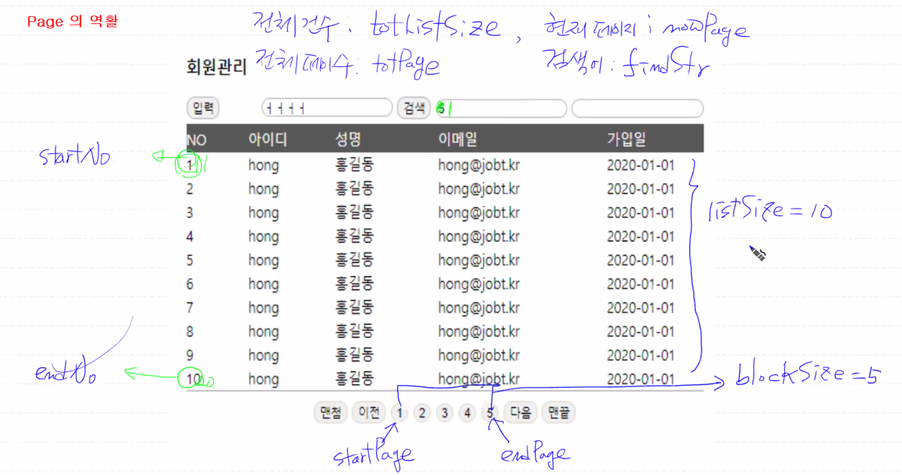

# 목차

- [목차](#목차)
- [1.회원관리 조회 (select.jsp)](#1회원관리-조회-selectjsp)
  - [1.1.member.js](#11memberjs)
    - [1.1.1. js삽입하고 스크립트에 member function넣어줌](#111-js삽입하고-스크립트에-member-function넣어줌)
    - [1.1.2. 편의를 위해서 getID(id)라는 function을 생성해줌](#112-편의를-위해서-getidid라는-function을-생성해줌)
    - [1.1.3. member function 생성(btnInsert클릭시)](#113-member-function-생성btninsert클릭시)
    - [1.1.4. btnFind클릭시](#114-btnfind클릭시)
    - [1.1.5. 페이지자동화](#115-페이지자동화)
    - [1.1.6. 각 페이지 눌렀을 시 각페이지 표시](#116-각-페이지-눌렀을-시-각페이지-표시)
    - [1.1.7. data 자동화](#117-data-자동화)
    - [1.1.8 상세정보로 이동](#118-상세정보로-이동)
- [2. 입력페이지 설정(insert.jsp)](#2-입력페이지-설정insertjsp)
  - [2.1. 목록눌렀을 때 (btnSelect)](#21-목록눌렀을-때-btnselect)
  - [2.2. 저장눌렀을 때](#22-저장눌렀을-때)
  - [2.3. 다음 api사용해 우편번호검색](#23-다음-api사용해-우편번호검색)
  - [2.4. 사진미리보기](#24-사진미리보기)
    - [2.4.1. 사진미리보기 영역, 파일업로드 영역](#241-사진미리보기-영역-파일업로드-영역)
    - [2.4.2. 이미지 파일 미리보는 코드](#242-이미지-파일-미리보는-코드)
- [3. 상세보기 페이지(view.jsp)](#3-상세보기-페이지viewjsp)
  - [3.1. 목록으로갈떄 페이지정도 유지하도록](#31-목록으로갈떄-페이지정도-유지하도록)
  - [3.2. 수정누르면 update.jsp로 이동](#32-수정누르면-updatejsp로-이동)
- [4. page](#4-page)
  - [4.1. page class 변수설정](#41-page-class-변수설정)
  - [4.2. page class](#42-page-class)
  - [4.3. 페이징](#43-페이징)
    - [4.3.1. 페이징계산](#431-페이징계산)
    - [4.3.2. pageCompute메소드 코드](#432-pagecompute메소드-코드)
- [5. servlet](#5-servlet)
  - [5.1. servlet 흐름](#51-servlet-흐름)
  - [5.2. MemberServlet](#52-memberservlet)
    - [5.2.1. HttpServlet상속](#521-httpservlet상속)
    - [5.2.2. Anootation 선언 + urlPatterns지정](#522-anootation-선언--urlpatterns지정)
    - [5.2.3. doGet() , doPost() 메소드를 오버라이딩](#523-doget--dopost-메소드를-오버라이딩)


# 1.회원관리 조회 (select.jsp)
- 입력버튼 누르면 입력페이지로 이동하도록
- 검색할시
  - 검색어 전달
  - 페이지는 1페이지로
  - 검색창에 값을 유지
- 페이징처리
  - 검색어정보 유지
  - 페이지가 이동
- 특정행 처리시 상세보기(view로 이동)
  - 검색정보 유지
  - 페이지정보

## 1.1.member.js
### 1.1.1. js삽입하고 스크립트에 member function넣어줌
### 1.1.2. 편의를 위해서 getID(id)라는 function을 생성해줌
```java
function getID(id) {return document.getElementById(id)}
```

### 1.1.3. member function 생성(btnInsert클릭시)
- btnInsert 클릭시 function 실행하도록
  - insert.jsp로 이동하도록
```javascript
var member = function(){
	//$('#btnInsert').on('click', function(){...})''
	
	var btnInsert = getID('btnInsert');
	
	let url = 'index.jsp?inc=./member/';
	
	if(btnInsert != null){
		btnInsert.onclick = function(){
			var frm = document.frm_member //form tag name, id값으로 접근해도됨
			frm.action = url + 'insert.jsp';
			frm.submit();
		}
	}
}
```

### 1.1.4. btnFind클릭시
- select.jsp (자기자신)으로 이동
- 검색value는 그대로 두고 page는 1로 
  - '${param.**}'활용
```html
<div>
	<input type = 'text' name = 'findStr' class = 'findStr' value = '${param.findStr }'>
	<input type = 'button' value = '검색' id = 'btnFind' />
	<input type = 'text' name = 'nowPage' value = '${param.nowPage }'/>
    </div>
```
<Br>

- btnInsert시 select.jsp로 이동
- nowPage의 value를 1로 설정
```javascript
var btnFind = getID('btnFind');
	
	if(btnFind != null){
		btnFind.onclick = function(){
			var frm = document.frm_member;
			frm.action = url + 'select.jsp';
			frm.nowPage.value = 1;
			frm.submit();
		}
	}
```

### 1.1.5. 페이지자동화
- 이랬던 페이지는 문제가 있다 나중에 99, 100이면 그거 다 쓸거아니잖아
```html
		<input type = 'button' value = '1' />
		<input type = 'button' value = '2'  />
		<input type = 'button' value = '3'  />
		<input type = 'button' value = '4'  />
		<input type = 'button' value = '5'  />
```

```html
<%@ taglib prefix="c" uri="http://java.sun.com/jstl/core_rt"  %>

		<c:forEach var = "i" begin = '1' end='5'>
			<input type = 'button' value = '${i }'/>
		</c:forEach>
		
```

### 1.1.6. 각 페이지 눌렀을 시 각페이지 표시
```javascript
function goPage(page){
	let url = 'index.jsp?inc=./member/';

	var frm = document.frm_member;
	frm.action = url + 'select.jsp';
	frm.nowPage.value = page;
	frm.submit();
}
```

### 1.1.7. data 자동화
- jstl의 foreach문을 사용해 10개의 데이타를 사용
- el표현식으로 no를 표현
  - 만약 아이디를 쓴다면 문자열이니까 '' 붙여야함
- item 영역을 입력하면 view function 실행하도록
  - view() -> view.jsp로 이동
```html
		<c:forEach var = 'vo' begin = '1' end = '10'>
			<div class = 'item' onclick = 'view(${vo})'>
				<span class = 'no'>${vo }</span>
				<span class = 'mid'>hong</span>
				<span class = 'name'>홍길동</span>
				<span class = 'email'>hong@jobt.kr</span>
				<span class = 'mdate'>2020-01-01</span>
			</div>
		</c:forEach>
```

### 1.1.8 상세정보로 이동
```javascript
function view(mid){
	let url = 'index.jsp?inc=./member/';

	var frm = document.frm_member;
	frm.action = url + 'view.jsp';
	frm.mid.value = mid;  
	frm.submit();
}
```

# 2. 입력페이지 설정(insert.jsp)
- 목록눌렀을 때 검색화면 이동
  - 검색어는 유지
  - 페이지 유지
- 저장눌렀을 시
  - form 태그에 enctype = 'multipart/form-data' 속성 추가해야함
  - request.getParameter()로 값을 가져올 수 없다 따라서 cos.jar와 같은 외부API필요
  - result페이지나오고 검색어, 페이지 날리기 
- 우편번호 검색
  - 다음 api 사용
- 파일선택했을시 이미지 미리보기

## 2.1. 목록눌렀을 때 (btnSelect)
- member function안에 btnselect이벤트 처리
```javascript
var btnSelect = getID('btnSelect');
	
	if(btnSelect != null){
		btnSelect.onclick = function(){
			var frm = document.frm_member;
			frm.action = url + 'select.jsp';
			frm.submit();
		}
	}
```

## 2.2. 저장눌렀을 때
```javascript
var btnSave = getID('btnSave');

if(btnSave != null){
		btnSave.onclick = function(){
			var frm = document.frm_member;
			//frm.enctype = 'multipart/form-data';
			frm.action = url + 'result.jsp';
			frm.submit();
		}
		
	}
```

## 2.3. 다음 api사용해 우편번호검색
- 우편번호
  - 다음에서 스크립트 가져옴
```java
<script src = 'http://dmaps.daum.net/map_js_init/postcode.v2.js'></script>

```
- member.js에서 `우편번호검색`클릭 시 실행되도록
```javascript
var btnFindZip = getID('btnFindZip');
	
	//다음 우편번호 검색 API를 사용한 주소 찾기
	if(btnFindZip != null){
		btnFindZip.onclick = function(){
			var frm = document.frm_member;
			new daum.Postcode({
				oncomplete : function(data){   //우편번호 정상적으로 입력했다면
					frm.zipcode.value = data.zonecode;
					frm.address.value = data.address;
				}
			}).open();
		}
	}
```

## 2.4. 사진미리보기
### 2.4.1. 사진미리보기 영역, 파일업로드 영역
- file input하는 곳과 그 사진을 미리보여주는 영역생성
```html
<label>사진</label>
<input type = 'file' name = 'photo' id='btnPhoto'/>
	
```

### 2.4.2. 이미지 파일 미리보는 코드
- 비슷한 로직이 반복되니 익숙해질것
```javascript
	if(btnPhoto != null){
		btnPhoto.onchange = function(evt){ //클릭아니고 체인지될때
			var tag = evt.srcElement; //이벤트 발생한 태그
			var url = tag.files[0]; //선택된 파일명
			var reader = new FileReader();
			reader.readAsDataURL(url); //file이 reader로 읽혀짐
			reader.onload = function(e){ //읽기 작업이 끝났다면
				var img = new Image();
				img.src = e.target.result;
				var photo = getID('photo');
				photo.src = img.src;
			}
		}
	}
```

# 3. 상세보기 페이지(view.jsp)
- 목록으로 되돌아갈때 검색어와 페이지정보 그대로 유지되야함
  - mid
  - nowPage
  - findStr를 view.jsp로 넘겨줌
  - select.jsp로 갈때 nowPage, findStr로 넘어감
- 수정하면 update로 넘어가게
  - mid, nowPage, FindStr 넘김
- 삭제누르면 prompt창을 띄워서 암호입력 -> 삭제하도록

## 3.1. 목록으로갈떄 페이지정도 유지하도록
```html
<input type = 'text' name = 'findStr' value = '${param.findStr }' />
<input type = 'text' name = 'nowPage' value = '${param.nowPage }' />
```

## 3.2. 수정누르면 update.jsp로 이동
- 이젠 익숙해짐..
```javascript
	var btnModify = getID('btnModify');
	
	if(btnModify != null){
		btnModify.onclick = function(){
		var frm = document.frm_member;
		frm.action = url + 'update.jsp';
		frm.submit();
		}
		
	}
```

- 삭제시 prompt창 띄워서 암호입력하고 result.jsp로 넘기기
```javascript
	var btnDelete = getID('btnDelete');
	
	if(btnDelete != null){
		btnDelete.onclick = function(){
			var frm = document.frm_member;
			var pwd = prompt("회원정보를 삭제하시려면 암호를 입력하세요");
			if(pwd != null){
				frm.action = url + 'result.jsp';
				frm.submit();	
			}
		}
	}
```

# 4. page 
## 4.1. page class 변수설정


  - 목록의 조회  
   첫번째 number : startNo  
  마지막 number : endNo  
  - 검색 전체 건수 : totListSize   
  현재 페이지 : notPage
  - 검색어 : findStr
  - 페이지갯수 : blockSize
    - 1: startPage  
    5: endPage
  - 목록갯수 : listSize
  - 전체 페이지 수 : totPage  

## 4.2. page class 
- 대략 이렇게 멤버필드와 생성자 생성해줌 + getter,setter
  
```java
public class Page {
	int totListSize;
	int totPage;
	int startPage;
	int endPage;
	int startNo;
	int endNo;
	int nowPage;
	int listSize = 10;
	int blockSize = 5;
	
	String findStr;
	
	public Page() {}
	public Page(int totListSize, int nowPage) {
		this.totListSize = totListSize;
		this.nowPage = nowPage;
		pageCompute();
	}

	public void pageCompute() {
		
	}

```

## 4.3. 페이징
### 4.3.1. 페이징계산

(기준) : totListSize, nowPage, listSize, blockSize  
  
totListSize = 115  (검색된 건수)
listSize = 10  
blockSize = 5  
nowPage(사용자가 보고있는 페이지) = 1 일때,  


`totPage 계산`  
totListSize/listSize = 11 (115/10 = 11)
- 절삭되서 11페이지밖에 안나옴. 그래서 나머지값들이 안나옴 따라서 정수형으로 바꿔줘야함

totListSize/(listSize*1.0) = 11.5 
- 이것을 Math.ceil로 절상을 하면 12.0이 나옴
- 그것은 다시 int형으로 casting하면 12가 나옴
```java
totPage = (int)(Math.ceil(totListSize/(double)listSize));
```
<br><br>


`endNo계산`  
```java
endNo = nowpage * listSize
```
<br><br>


`startNo계산`  
```java
startNo = endNo-listSize + 1
```
<br><br>


`endPage계산`  
- (1/5.0) * 5 = 1*5 = 5 (nowPage가 6일때)
- (6/5.0) * 5 = 2*5 = 10  
계산하면 절삭되서 0이 나오니까 double타입으로 형변환하고 ceil로 절상하면 1이됨
```java
endPage = (int)(Math.ceil(nowPage/(double)blockSize)) * blockSize;
```
  <br>
<br>


`startPage계산`  
```java
startPage = endPage - blockSize +1
```
<br>
<br>

`페이징표`

|nowPage|totPage|endNo|startNo|endPage|startPage|
|---|--|--|--|--|--|
|1|12|10|1|5|1
|2|12|20|11|5|1
|3|12|30|21|5|1
|.|.|.|.|.|.
|6|12|60|51|10|6
<br><br>

`example`  
totListSize = 123  
listSize = 10  
blockSize = 5  일때   
totPage먼저 계산해야함  => 13

|nowPage|endNo|startNo|endPage|startPage|
|---|--|--|--|--|--|
|1|10|1|5|1
|7|70|61|10|6
|13|`130`|121|`15`|11
<br>

endNo가 totListSize보다 크면 endNo 에 totlistSize를 넣어야함
```java
if(endNo > totListSize) endNo = totListSize;
```
endPage가 totPage보다 클 떄 보정작업
```java
if(endPage > totPage) endPage = totPage;
```

### 4.3.2. pageCompute메소드 코드
- totListSize와 nowPage가 기준이 됨
```java
public void pageCompute() {
		totPage = (int)(Math.ceil(totListSize/(double)listSize));
		endNo = nowPage * listSize;
		startNo = endNo - listSize + 1;
		if(endNo > totListSize) endNo = totListSize;
		
		endPage = (int)(Math.ceil(nowPage/(double)blockSize)) * blockSize;
		startPage = endPage-blockSize + 1;
		if(endPage > totPage) endPage = totPage;
		
	}
```

# 5. servlet
## 5.1. servlet 흐름
- servlet과 Dao는 독립적이어야한다  
의존성을 최소화시켜야함  
외부 환경구조에 따라 내부환경 바뀌지 않음 -> 가장 좋음
```
요청 -> servlet요구분석 -> Dao -> DB  
요청 <- servlet요구분석 <-  Dao <─┘
```
## 5.2. MemberServlet

### 5.2.1. HttpServlet상속
```java
import javax.servlet.http.HttpServlet;

public class MemberServlet extends HttpServlet
```

### 5.2.2. Anootation 선언 + urlPatterns지정
- /member.do 형식으로 들어오면 servlet이 요청분석 후 적당한 dao에 배부
  - 입력시 Adao, 수정시 Bdao, 삭제시 Cdao 등으로 분리
```java
import javax.servlet.http.HttpServlet;

@WebServlet(urlPatterns = "/member.do")
```

### 5.2.3. doGet() , doPost() 메소드를 오버라이딩
- 단축어 : `shift + alt + s` -> `v`
```java
	@Override
	protected void doGet(HttpServletRequest req, HttpServletResponse resp) throws ServletException, IOException {
		// TODO Auto-generated method stub
		super.doGet(req, resp);
	}

	@Override
	protected void doPost(HttpServletRequest req, HttpServletResponse resp) throws ServletException, IOException {
		// TODO Auto-generated method stub
		super.doPost(req, resp);
	}
```
